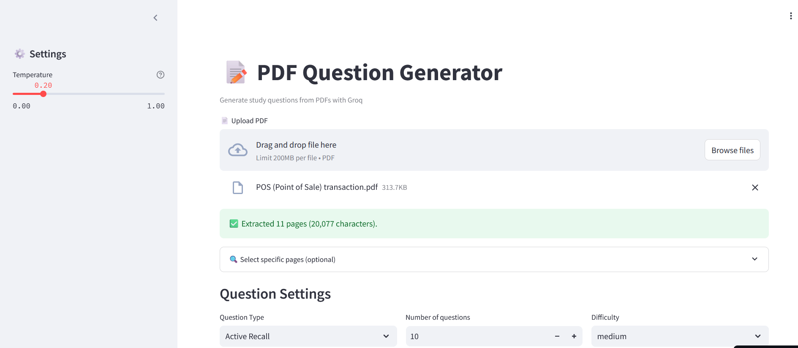

# PDF Question Generator 



Streamlit App Link - https://pdfquestionsgenerator-mvysmsc9lzyat3vumbelyd.streamlit.app/

Generate high-quality **MCQ**, **Active Recall**, and **Closure (cloze/fill-in-the-blank)** questions directly from a PDF.
Built with **Streamlit**, uses **Groq**’s `llama-3.3-70b-versatile` (fixed) under the hood, and exports to **PDF**.

> ✨ Ideal for students, educators, and creators who want fast study materials from their own notes/books.


---

## ✨ Features

* **Three question types**

  * **MCQ**: 4 options, answer key, short explanation.
  * **Active Recall**: open-ended questions **with answers** (2–3 sentences or 2–4 bullets).
  * **Closure (Cloze)**: one `____` blank per question + answer.
* **From any PDF**: upload once, optionally select a **page range**.
* **Clean PDF export**: download questions (and answers if you choose) as a nicely formatted PDF.
* **Deterministic by default**: low temperature (0.2) slider to tune creativity.
* **Fixed model**: `llama-3.3-70b-versatile` (no model picker in UI).
* **Robust JSON parsing & validation** to keep outputs consistent.
* **Lightweight & local UI**: Streamlit app, no server to maintain.

---

## 🧱 Tech Stack

* **UI**: Streamlit
* **LLM**: Groq Chat Completions (`llama-3.3-70b-versatile`)
* **PDF parsing**: `pypdf`
* **PDF export**: `reportlab`
* **Config**: `.env` via `python-dotenv`
* **Packaging**: `pyproject.toml` (+ `uv.lock`)

---

## 📦 Project Structure

```
.
├─ app.py                # Streamlit app (UI + orchestration)
├─ pyproject.toml        # Dependencies (uv/pip can read this)
├─ uv.lock               # Locked dependency versions (commit this)
├─ .env.example          # Example env (copy to .env locally)
├─ .gitignore
└─ README.md
```

---

## ⚙️ Setup

### 1) Get a Groq API key

Create one at [https://console.groq.com/keys](https://console.groq.com/keys)

### 2) Add your `.env`

Copy the example and fill in your key:

```bash
cp .env.example .env
# then edit .env to set your key
```

`.env`:

```env
GROQ_API_KEY=YOUR_KEY_HERE
```

> 🔐 **Never commit `.env`**. It’s already in `.gitignore`.

### 3) Install dependencies

**Option A — uv (recommended)**

```bash
pip install -U uv
uv pip install -r pyproject.toml
```

**Option B — pip**

```bash
pip install groq python-dotenv streamlit pypdf reportlab
```

> Python 3.11+ recommended.

### 4) Run the app

```bash
streamlit run app.py
```

Open the local URL printed in the terminal.

---

## 🚀 How to Use

1. **Upload a PDF**.
2. (Optional) Expand **“Select specific pages”** and choose a page range.
3. Set **Question Type**, **Number of questions**, and **Difficulty**.

   * Toggle **“Include answers in PDF”** if you want answer keys embedded.
4. Click **“Generate Questions”**.
5. Review the **Preview** section.
6. Click **Download PDF**.

**Temperature** (sidebar): lower = more precise; higher = more creative.

---

## 🧩 Output Schemas (for reference)

The app prompts the model to return consistent JSON. Internal validators coerce/clean as needed.

### MCQ

```json
{
  "questions": [
    {
      "question": "What is the main concept?",
      "options": ["First", "Second", "Third", "Fourth"],
      "correct_answer": "A",
      "explanation": "One short sentence."
    }
  ]
}
```

### Active Recall (open-ended, **with answers**)

```json
{
  "questions": [
    {
      "question": "How do concepts X and Y relate?",
      "answer": "2–3 sentences or 2–4 bullet points."
    }
  ]
}
```

### Closure / Cloze (exactly one blank `____`)

```json
{
  "questions": [
    {
      "question": "The process of ____ is essential for learning.",
      "answer": "repetition"
    }
  ]
}
```

---

## 🛡️ Safety & Privacy

* Your PDF text is sent to Groq only for generation.
* **Do not** commit any private PDFs or `.env` to GitHub.
* If using Streamlit Community Cloud, set the `GROQ_API_KEY` in **Secrets**.

---

## ☁️ Deploy Options

### Streamlit Community Cloud

1. Push this repo to GitHub.
2. Go to [https://share.streamlit.io](https://share.streamlit.io) → **New app**.
3. Pick your repo and `app.py`.
4. Add `GROQ_API_KEY` under **App settings → Secrets**.
5. Deploy.

### GitHub Codespaces / Local server

* Launch a Codespace or any VM, install deps (see above), then:

  ```bash
  streamlit run app.py --server.address 0.0.0.0 --server.port 8501
  ```

---

## 🧰 Troubleshooting

* **`GROQ_API_KEY not found`**
  Make sure `.env` exists and contains your key, or set Streamlit **secrets**.

* **No questions generated**

  * Select a smaller page range (some PDFs are huge).
  * Lower **Temperature**.
  * Ensure the source pages have **extractable text** (scanned PDFs need OCR first).


---

## 🤝 Contributing

PRs and issues welcome!
If you’re adding dependencies, please update `pyproject.toml` and keep `uv.lock` in sync.

---

## 📄 License

MIT

---

## 🙌 Acknowledgements

* [Streamlit](https://streamlit.io/)
* [Groq](https://groq.com/)
* [pypdf](https://pypdf.readthedocs.io/)
* [ReportLab](https://www.reportlab.com/dev/opensource/)

---
